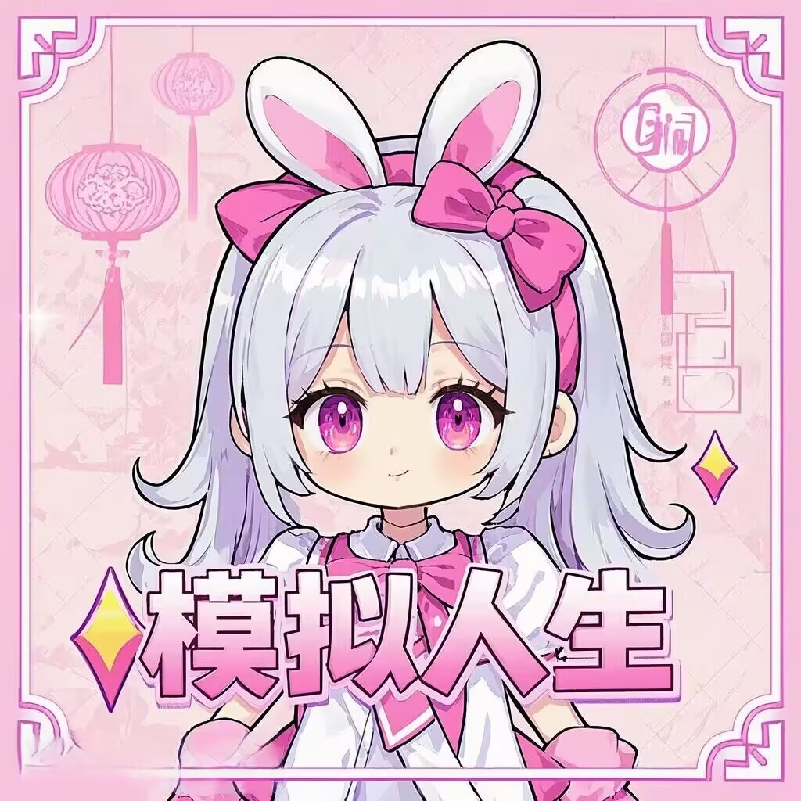

# 模拟人生插件 (Sims Plugin V1.0.0 Beta)

<div align="center">
  
  <br/>
  <b>为Yunzai-Bot打造的生活模拟游戏插件</b>
  <br/>
  <br/>
</div>

## 🌟 插件介绍
哇奥！这是一款为Yunzai-Bot设计的超级有趣的生活模拟游戏插件喔~ 让你在聊天群组中体验充满惊喜和欢乐的模拟人生玩法！是不是很心动呢？无论是成为帅气的警察维护秩序，还是当一名超厉害的厨师烹饪美食，亦或是在游戏区度过悠闲的时光，都能在这里找到属于你的梦想职业道路！让我们一起在模拟世界中创造属于自己的小确幸吧~

## ✨ 核心功能

### 👮 警察系统
- 加入警察，维护社会秩序，成为正义的守护者~
- 从实习警员晋升至高级职位，一步步实现梦想！
- 处理各类案件，执行特别行动，保卫城市安全！
- 购买和维护装备，提升技能，变得更强大！

### 🎮 网吧系统
- 体验网吧生活，畅玩各类游戏，享受悠闲时光~
- 消费网吧食品，提升游戏体验，吃货福音！
- 管理自己的网吧设施，打造舒适空间！
- VIP会员系统，享受专属特权服务，超级厉害！

### 🎣 钓鱼系统
- 轻松休闲的钓鱼体验，放松心情~
- 升级鱼竿与鱼饵，增加成功率，钓大鱼！
- 收集各种稀有鱼类，出售获取收益，变成小富婆！
- 参与钓鱼排行榜，争夺钓鱼大师称号，展示实力！

### 👨‍⚕️ 医生模拟
- 成为医生，治疗各类患者，拯救生命~
- 提升医疗技能，解决疑难杂症，成为天才医生！
- 参与手术，挽救生命，感受成就感！
- 升级医院设备，提高治愈率，打造梦想医院！

### 👨‍🚒 消防员模拟
- 体验消防员的紧张工作，成为勇敢的救火英雄~
- 扑灭各类火灾，救援被困人员，守护城市！
- 升级消防装备，提高救援效率，变得更强！
- 参与特殊灾难救援行动，展现非凡勇气！

### 👨‍🍳 厨师模拟
- 学习烹饪技艺，制作美食佳肴，成为小厨娘~
- 解锁新菜谱，提升烹饪等级，挑战高难度料理！
- 开设餐厅，招待顾客获取收益，实现美食梦想！
- 参加烹饪比赛，展示厨艺，赢取荣誉和奖励！

### 🎬 电影院系统
- 观看各类电影，获得不同体验
- 购买小吃饮料，提升观影体验
- 收集电影票根，完成收藏

### 🕹️ 更多功能
- 严格的防作弊系统，确保游戏公平
- 关注我，第一时间获取更多精彩内容！

## 📋 使用方法

1. 使用 `#模拟人生帮助` 查看完整命令列表
2. 使用 `#开始模拟人生` 创建你的角色
3. 选择职业道路，开始你的模拟人生之旅！
4. 如何更新？
 - 使用指令`#模拟人生更新`
## 安装
在Yunzai根目录运行命令
```
#两种下载方式任选其一即可
git clone https://github.com/nahida2203/sims-plugin.git ./plugins/sims-plugin/
pnpm i
#网络不好可以使用gitcode进行克隆
git clone https://gitcode.com/nahida22/sims-plugin.git ./plugins/sims-plugin/
pnpm i
```
## 🔮 后续计划

1. **职业系统扩展**：添加更多职业选择，如教师、建筑师、程序员等
2. **家庭系统完善**：增加家庭互动，子女培养等家庭生活内容
3. **经济系统深化**：更复杂的经济模型，包括通货膨胀、股市波动等
4. **版本活动**：根据插件更新推出特色活动内容
5. **插件整体结构及功能的优化**：随着版本更新会不断地优化整体的结构和功能
## 💌 开发者寄语

模拟人生插件诞生于对我对现实生活多样性的热爱与向往。在这个虚拟世界里，你可以尝试不同的人生道路，体验各种职业带来的乐趣和挑战。

我希望这个插件不仅仅是一个游戏，更是一个让你思考人生可能性的窗口。无论你选择成为警察、医生还是厨师，每一种人生都值得尊重和体验。
让我们一起在模拟人生的世界里，创造属于自己的小小奇迹吧！一起加油！٩(๑❛ᴗ❛๑)۶

## 📞 联系方式

如有问题或建议，请通过以下方式联系我们：

- 点开我的主页私信我
 & [点击跳转我的QQ](https://qm.qq.com/q/a55MXIlQFa)
 & [点击跳转我的QQ群](http://qm.qq.com/cgi-bin/qm/qr?_wv=1027&k=MBjLULnf3r-PjDSr1j8lTLyhjAy1Xeur&authKey=aqzhQsD0XDgBeLy5pYY3ejnsjIELm9XYjRCQUhd95HmBjf18I7wu%2BrmZwas7z3Ex&noverify=0&group_code=939882404)
- 点开我的主页私信我
 & [点击跳转我的QQ](https://qm.qq.com/q/a55MXIlQFa)
 & [点击跳转我的QQ群](http://qm.qq.com/cgi-bin/qm/qr?_wv=1027&k=MBjLULnf3r-PjDSr1j8lTLyhjAy1Xeur&authKey=aqzhQsD0XDgBeLy5pYY3ejnsjIELm9XYjRCQUhd95HmBjf18I7wu%2BrmZwas7z3Ex&noverify=0&group_code=939882404)
- gitcode Issues：[提交问题](https://gitcode.com/nahida22/sims-plugin/issues)
参与贡献请Fock本仓库修改代码后发起[Pull Request](https://gitcode.com/nahida22/sims-plugin/pulls)  
如果你对本仓库表示支持，请点点你手中的Star，开发者会超级感动的啦～

##  插件结构一览

呜喵～让我为大家介绍一下插件结构吧！每一个文件夹都有它的用途哦～嘻嘻

```
sims-plugin
├── apps/                 存放各种职业和游戏系统核心代码
│   └── ...               在这里你可以查看功能的命令正则噢~
│   
├── data/                 存放游戏数据和配置文件
│   ├── fish.json         钓鱼系统鱼类数据
│   ├── police_data.json  警察系统数据
│   ├── netbar_data.json  网吧系统数据
│   └── ...               其他各种职业的数据文件
│
├── function/             存放通用功能函数
│   ├── function.js       通用功能函数
│   └── cooldown.js       冷却时间控制函数
│
├── model/                存放数据模型
│   ├── Version.js        版本信息处理
│   ├── Data.js           数据处理模型
│   └── Cfg.js            配置处理模型
│
├── resources/            存放资源文件
│   ├── HTML/             渲染模板文件
│   └── img/              图片资源文件
│
├── config/               插件配置目录
│   └── ...               各种配置文件
│
├── index.js              插件入口文件
├── package.json          插件包信息
└── README.md             你现在看到的说明~嘻嘻

```

上面的每个部分都有自己的任务呢，它们共同构成了这个美妙的模拟世界～ 如果你对哪部分感兴趣，可以去看看源代码，说不定会有意外发现呢！

## ❓ 常见问题及解决方法

哎呀呀～遇到问题了吗？别担心～我们来帮你解决啦！

### 2. Q: 游戏中的金币获取好慢啊，怎么办？
   A: 嘿嘿～初期确实会有点慢呢！可以尝试钓鱼系统或者选择高收益的职业哦！坚持每天签到也能获得不少奖励，后续版本更新也会有高收益的活动，加油哦！

### 3. Q: 我的游戏数据不见了怎么办？
   A: 呜哇～别着急！可以检查一下插件的data文件夹是否完好。如果真的丢失了，emmmm，那就是丢了QAQ～

### 4. Q: 插件安装后没反应怎么办？
   A: 唔～可能是安装过程出了小问题呢！请确认以下几点：
   - 崽崽是否正常运行
   - 是否已经执行了`pnpm i`安装依赖
   - 插件文件夹名称是否正确是`sims-plugin`
   -如果都不行可以尝试重新安装插件噢
   如果都没问题还是不行，请通过上面的联系方式联系我哦٩(๑❛ᴗ❛๑)۶

### 5. Q: 我想提交新功能建议，怎么做？
   A: 哇嗷！太棒啦～欢迎你的创意！可以通过以下方式提交建议哦：
   - 在QQ群里告诉我们
   - 在Gitee仓库提交Issue
   - 或者直接给开发者发送私信
     我们超级期待你的点子呢！嘻嘻

### 6. Q: 游戏职业选择后能更换吗？
   A: 嘻嘻～目前暂时不支持更换职业哦！不过，你可以尝试在其他职业中体验不同的乐趣呢！

### 7. Q: 为什么有些功能无法使用？
   A: 呜呜～可能是因为：
   - 功能需要更高等级才能解锁呢
   - 功能正在维护中，请耐心等待一下啦
   
如果你遇到了其他问题，随时来找我们帮忙哦！开发者随时为你解答疑惑～

---

<div align="center">
  <b>模拟人生插件 - 体验无限可能的人生</b>
  <br/>
  <small>Made with ❤️ by Sims Plugin </small>
</div>